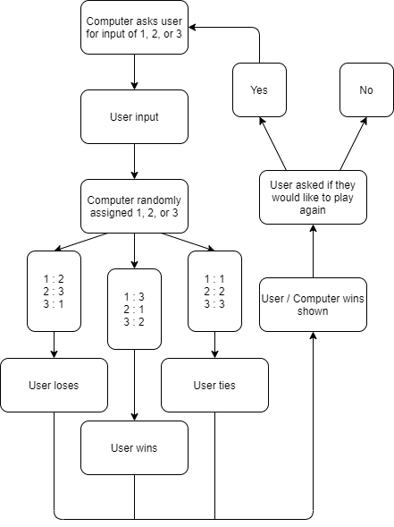

## CPP-Chapter-6-7
<b>4.7</b>  
#1.Games where you're given the option to play again would be impossible to program without loops, as well as any other program that does the same thing for an unspecified amount of times.  
#2. The main advantage of a switch statement is that they can be a lot less repetetive than if statements, but if statements can be more complex. You should use a while loop over a do while loop when the user has a decision to begin the loop or not, a do while loop runs once before evaluating anything.  
#3. My favorite game in terms of looping is Nuclear Throne because upon beating the game, you can return to the start with slightly more difficult enemies. This is very fitting, as it makes it so a single playthrough of the game can last much longer.  
<b>5.1</b>  
  
